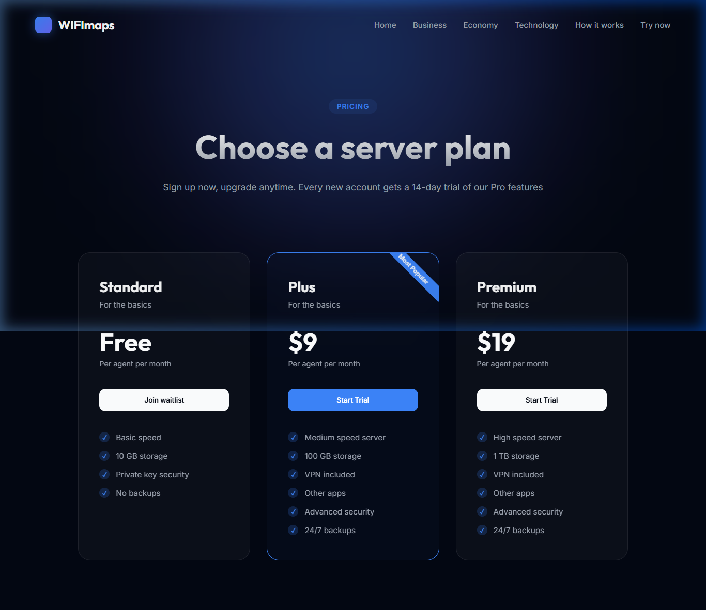

# WIFImaps | Premium Server Pricing Landing Page



A modern, high-performance, and visually stunning pricing landing page for **WIFImaps**. This project features a premium glassmorphism design, sophisticated typography, and a mobile-responsive layout.

## 🚀 Features

- **Premium Aesthetics**: Deep dark theme with glowing radial gradients and mesh background effects.
- **Glassmorphism**: Sleek pricing cards with backdrop blurring and subtle inner shadows.
- **Typography**: Optimized for readability using Google Fonts (`Inter` for body and `Outfit` for headlines).
- **Interactive UI**: Hover transitions and lift effects for pricing tiers.
- **Responsive Design**: Built using robust CSS Grid logic to ensure compatibility across all screen sizes.
- **Professional Structure**: Organized and clean HTML/CSS architecture.

## 🛠️ Tech Stack

- **HTML5**: Semantic structure.
- **CSS3**: Modern layouts with Flexbox and Grid.
- **Google Fonts**: Inter & Outfit.

## 📦 Setup & Installation

1. Clone the repository:
   ```bash
   git clone https://github.com/charaf12-u/WIFImaps.git
   ```
2. Navigate to the project directory:
   ```bash
   cd WIFImaps
   ```
3. Open `index.html` in your favorite browser.

## 📄 License

This project is open-source and available under the [MIT License](LICENSE).
